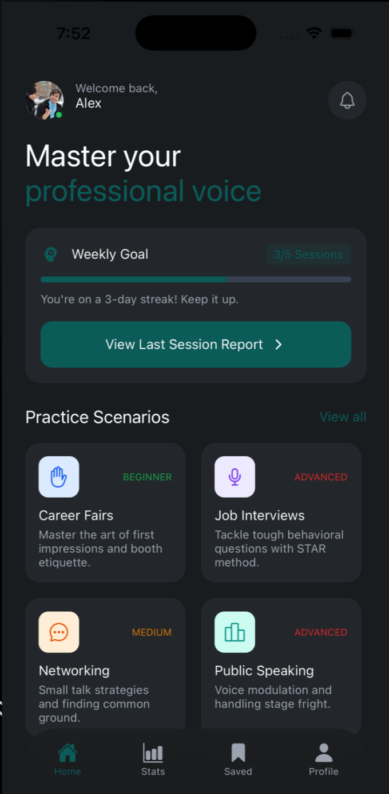

# Drift User Manual

## Overview

Drift is an app that uses conversational AI to put users into professional situations to improve their speech. It allows users to practice real conversations in a low-pressure environment. After every scenario, the transcript is sent to an external AI, which will score the user’s responses through text and vocal tone. It gives specific tips so the user knows what to focus on improving.

## Users

- Students looking for an internship/job
- Anyone who is starting a new job
- People who have trouble reading social situations
- International individuals who have trouble picking up on the small intricacies of English (especially in a professional environment)

## Purpose

The objective of this application is to help users improve communication skills, specifically in professional settings. Real professional scenarios are simulated so the user can put themselves in a situation and see how they would react, such as meeting someone at a career fair. The application uses AI to analyze the transcript and the vocal tone to provide meaningful feedback and specific areas of improvement. The user can also track improvements over time.

## Requirements

- A Mac or Windows computer
- Node.js installed
- npm installed
- iOS: Xcode installed
- iOS: iOS Simulator installed
- Android: Android Studio installed
- Android: Android Emulator installed or Android phone connected
- Hume account
- Gemini acconnt
- Project files downloaded
- Required `.env` keys added

This has been tested on MacOS and on iOS, and although it should work on Windows and Android, it has not been tested, and errors may occur.

## Environment

Add this to `.env`:

```bash
EXPO_PUBLIC_HUME_API_KEY=your_hume_key
EXPO_PUBLIC_HUME_CONFIG_ID=your_hume_config_id
EXPO_PUBLIC_GEMINI_API_KEY=your_gemini_key
```

## Install

1. Open Terminal
2. Open the project folder
3. Run:

```bash
npm install
```

4. If on iOS, run:

```bash
npx pod-install ios
```

5. If on Android, open Android Studio and start an emulator or connect an Android phone

## Start

1. Open Terminal
2. Open the project folder
3. Run:

```bash
npx expo start
```

4. If on iOS, press `i`
5. If on Android, press `a`

## Rebuild

If on iOS:

```bash
npx expo run:ios
```

If on Android:

```bash
npx expo run:android
```

Wait for install to finish

## Stop

1. Go to Terminal
2. Press `Control + C`
3. If on iOS, close Simulator if needed
4. If on Android, close Emulator if needed

## Uninstall

If on iOS:

1. Open iOS Simulator
2. Find the app icon
3. Click and hold the icon
4. Tap delete

If on Android:

1. Open Android Emulator or Android phone
2. Find the app icon
3. Click and hold the icon
4. Tap uninstall

Remove project packages:

```bash
rm -rf node_modules
```

## Screenshots




### Starting a scenario

1. Open the app
2. Tap topic
3. Pick a lesson
4. Start practice

### Voice Session

1. Read the prompt
2. Speak into the phone
3. Answer the recruiter
4. End the call

### Score

- Overall score
- Content score
- Clarity score
- Structure score
- Relevance score
- Vocal delivery score
- Strengths
- Next practice steps

## Microphone

Tap Allow when asked

If access is blocked:

If on iOS:

1. Open iPhone Settings
2. Find the app
3. Turn on Microphone

If on Android:

1. Open Android Settings
2. Find the app
3. Turn on Microphone

## Problems

### App Will Not Start

Try this:

```bash
npm install
npx expo start
```

### iOS Build Fails

Try this:

```bash
npx pod-install ios
npx expo run:ios
```

### Android Build Fails

Try this:

```bash
npx expo run:android
```

### Voice Session Will Not Connect

Check:

- Hume API key is set
- Hume config ID is set
- Internet is working
- App was rebuilt after native changes

### Score Does Not Use Gemini

Check:

- `EXPO_PUBLIC_GEMINI_API_KEY` is set

If Gemini fails, the app may show a local score.

### Microphone Does Not Work

Check:

- Microphone permission is allowed
- If on iOS: Simulator audio input is available
- If on Android: Emulator audio input is available
- Device volume is on

## Checklist

- Restart Expo
- If on iOS: rebuild the iOS app
- If on Android: rebuild the Android app
- Check `.env`
- Check internet connection
- Check microphone permission
- If on iOS: restart the simulator
- If on Android: restart the emulator

## Support

August Wetterau
august.wetterau1742@gmail.com
